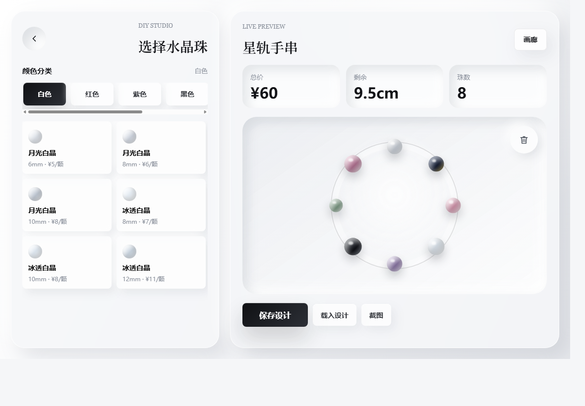
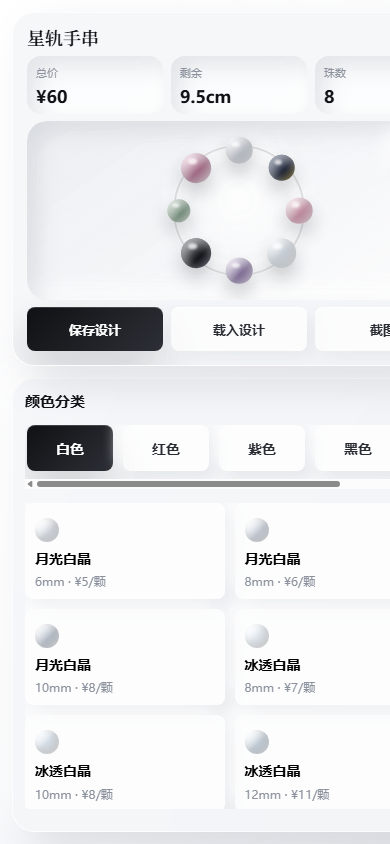

# 水晶 DIY 手串原型

一个手机和平板优先的水晶手串 DIY H5 原型。顾客可以选择手围、按颜色分类挑选水晶珠、在主视图中预览手串、拖动调整珠子顺序、删除珠子，并保存/载入设计代码。

## 当前版本

这是一个纯静态前端版本，不依赖后端、不需要构建工具，直接打开 `index.html` 即可预览。

## 功能

- 首页展示品牌视觉，并提供“开始设计”和“查看画廊”入口。
- 点击“开始设计”后弹窗选择手围，系统按手围 `+0.8cm` 计算推荐成品尺寸。
- 设计器支持手机上下布局和平板/桌面左右布局。
- 珠子按颜色分类横向切换：白色、红色、紫色、黑色、绿色、黄色。
- 每个颜色分类下展示对应 SKU、尺寸和单价。
- 点击 SKU 会添加一颗珠子到主视图。
- 主视图实时显示总价、剩余长度和珠数。
- 珠子可拖动换位，松手后整串珠子会围绕圆圈动态归位。
- 珠子可拖到右上角垃圾桶删除。
- 点击“保存设计”会生成设计代码。
- 点击“载入设计”可粘贴设计代码，还原原来的手围、珠子顺序和价格。
- 保存弹窗支持复制设计代码，并包含复制失败时的手动复制兜底。

## 预览

首页：


设计器：



手机设计器：



## 文件结构

```text
.
├── index.html
├── styles.css
├── app.js
├── home-screenshot.png
├── designer-screenshot.png
├── mobile-home-screenshot.png
└── mobile-designer-screenshot.png
```

## 本地打开

直接双击 `index.html`，或用浏览器打开：

```text
file:///.../index.html
```

## 后续方向

- 替换演示 SKU 为真实商品数据。
- 接入更稳定的短码/压缩码格式。
- 完成截图导出功能。
- 增加固定成品画廊内容。
- 进一步打磨真实水晶材质视觉。
- 后续如需要上线，可部署到 GitHub Pages、Cloudflare Pages 或静态网站托管。
